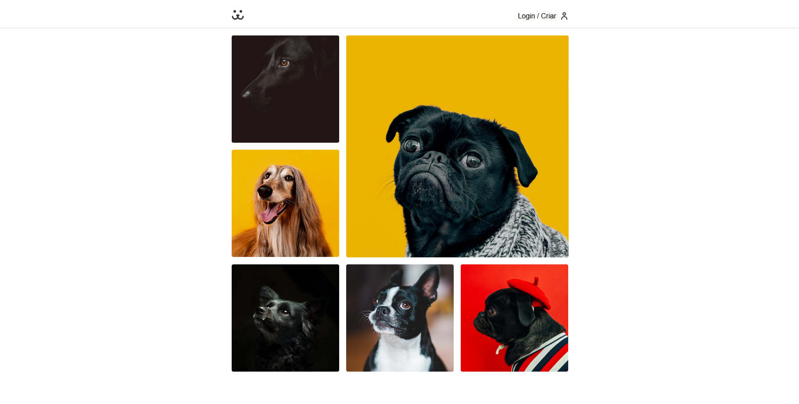
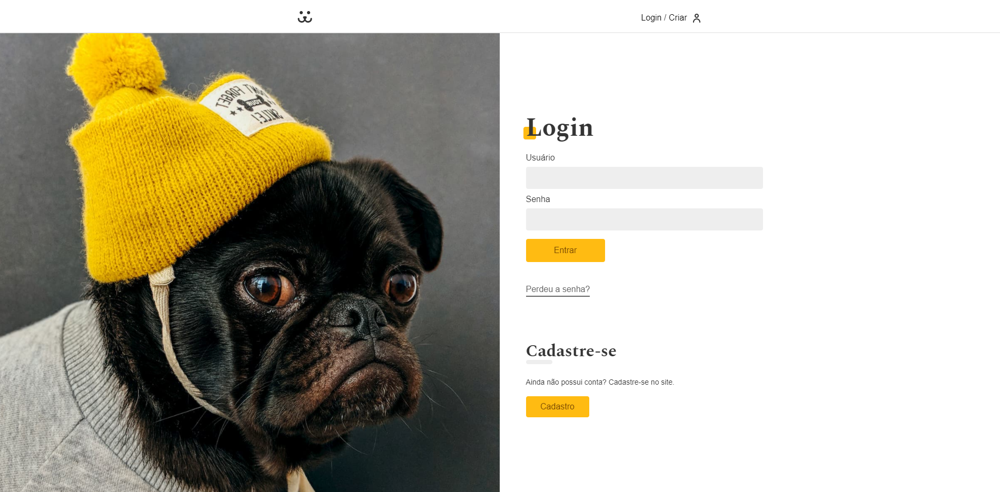
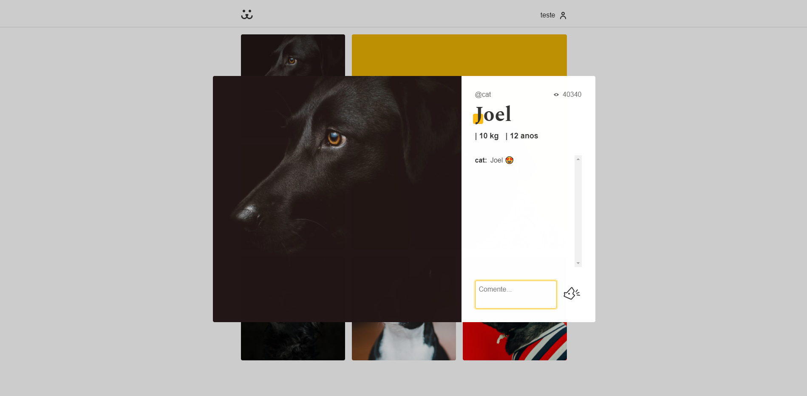
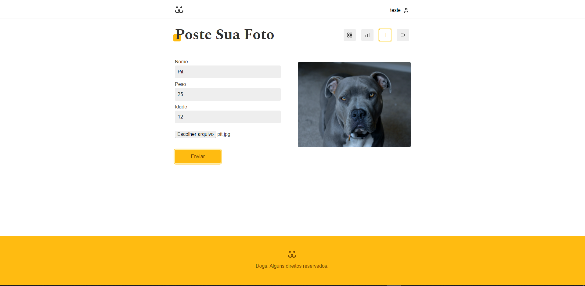
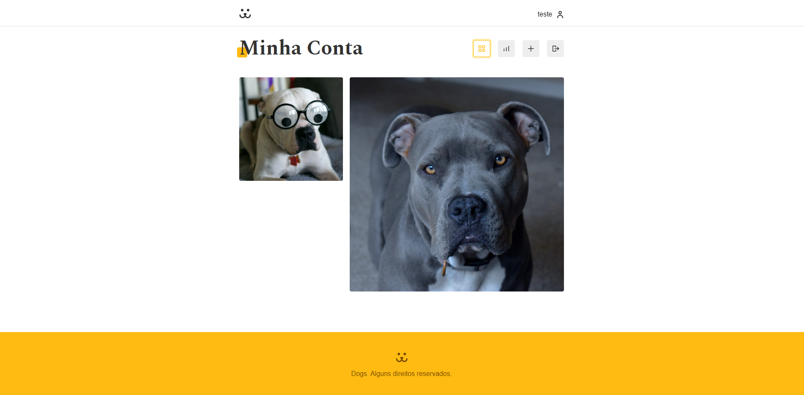

# Dogs

## 💻 Projeto

Dogs é uma rede social de fotos de cachorros, criada a partir dos cursos de React e Redux da plataforma [Origamid](https://www.origamid.com/), para aumentar o desafio e aprendizado, utilizei tecnologias que não foram tratadas durante o curso, como, Styled Components para estilização, TypeScript para tipagem e Formik e Yup para formulários. Apesar de simples, o projeto é completo, tendo:

- Consumo de API
- Gerenciamento de Estado
- Sistema de Rotas
- Páginas de Login, Cadastro, Perdeu a senha e Resetar senha
- Validação de Formulários
- Autenticação de Usuário

___

## 📷 Demonstração

___

___

___

___

___

___

## :hammer_and_wrench: Tecnologias

- **[TypeScript](https://www.typescriptlang.org/)**
- **[React](https://pt-br.reactjs.org/)**
- **[React Router DOM](https://reactrouter.com/core/guides/philosophy)**
- **[React Helmet](https://github.com/nfl/react-helmet)**
- **[Redux Toolkit](https://redux-toolkit.js.org/)**
- **[Styled Components](https://styled-components.com/)**
- **[Formik](https://formik.org/)**
- **[Yup](https://github.com/jquense/yup)**
- **[Victory](https://formidable.com/open-source/victory/)**
- **[ESLint](https://eslint.org/)**
- **[Prettier](https://prettier.io/)**
