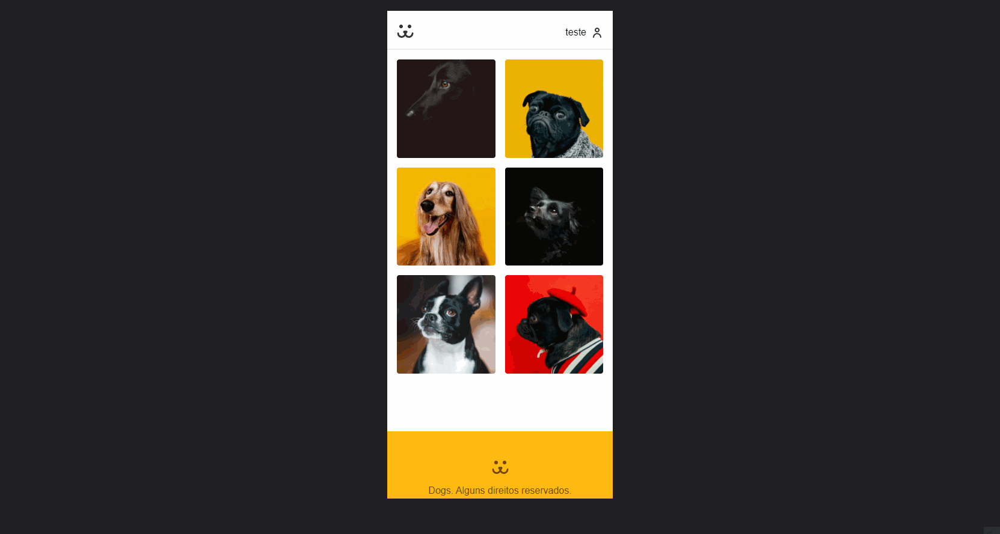

<div align="center">
  
</div>

## 💻 Sobre o projeto

Dogs é uma rede social de fotos de cachorros, desenvolvida a partir dos cursos de React e Redux da plataforma **[Origamid](https://www.origamid.com/)**, o usuário pode comentar em fotos de outros usuários e pode postar as suas próprias. Para aumentar o desafio e aprendizado, utilizei tecnologias que não foram tratadas durante os cursos, como Styled Components para estilização, TypeScript para tipagem e Formik e Yup para formulários.

- **[Acesse a aplicação](https://dogs-origamid-two.vercel.app/)**


---



---

## :hammer_and_wrench: Tecnologias utilizadas

- **[TypeScript](https://www.typescriptlang.org/)**
- **[React](https://pt-br.reactjs.org/)**
- **[Styled Components](https://styled-components.com/)**
- **[React Router](https://reactrouter.com/core/guides/philosophy)**
- **[Redux Toolkit](https://redux-toolkit.js.org/)**
- **[Formik](https://formik.org/)**
- **[Yup](https://github.com/jquense/yup)**
- **[Victory](https://formidable.com/open-source/victory/)**
- **[ESLint](https://eslint.org/)**
- **[Prettier](https://prettier.io/)**

---

## ⚙️ Executando o projeto

### Pré-requisitos

- **[GIT](https://git-scm.com/)**
- **[Node](https://nodejs.org/en/)**
- **[Yarn](https://classic.yarnpkg.com/en/docs/install/)**

**Clone o repositório**

```
git clone https://github.com/theandersonfonseca/dogs.git
```

**Acesse a pasta do projeto**

```
cd dogs
```

**Instale as dependências**

```
npm install
```

**Inicie a aplicação**

```
npm start
```

---

Feito com 💜 por **[Anderson Fonseca](https://github.com/theandersonfonseca)**.
